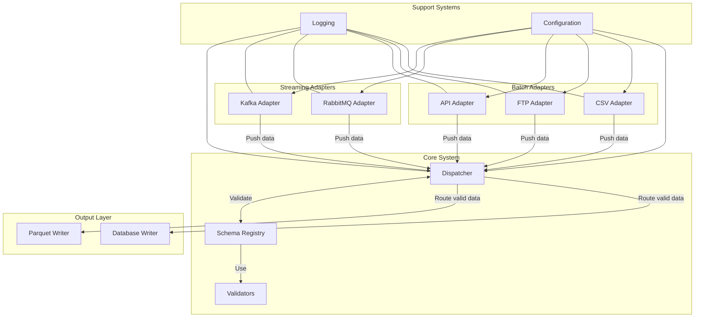
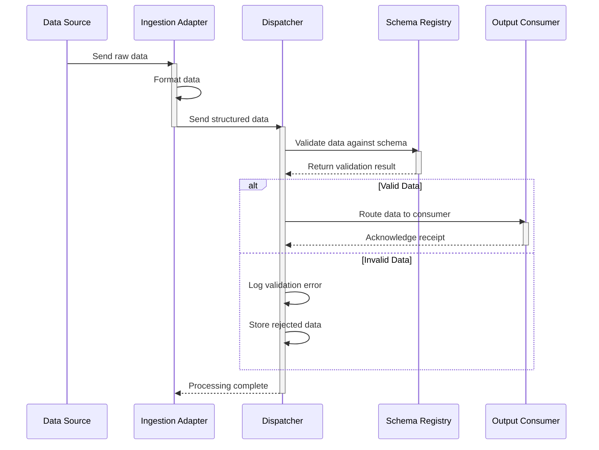

# Medplat | Unified Data Ingestion System
<p align="center">
  
  
  
</p>

## Overview

The Unified Data Ingestion System is designed to handle both streaming and batch data ingestion with a modular architecture. It centralizes data flow through a dispatcher and validates incoming data against versioned schemas.

## Features

- **Streaming Data Ingestion**: Supports real-time data ingestion from Kafka.
- **Batch Data Ingestion**: Handles data from REST APIs and FTP servers.
- **Centralized Dispatcher**: Routes and validates data before sending it to the output layer.
- **Schema Management**: Utilizes a schema registry for versioned schema validation.

## Project Structure

```
unified-data-ingestion-system
├── src
│   ├── adapters          # Contains ingestion adapters
│   ├── dispatcher        # Centralized dispatcher logic
│   ├── schema_registry   # Manages schema versions
│   ├── config            # Configuration settings
│   ├── utils             # Utility functions
│   └── main.py           # Entry point of the application
├── tests                 # Unit tests for the application
├── schemas               # JSON schemas for validation
├── docker-compose.yml    # Docker Compose configuration
├── Dockerfile            # Docker image build instructions
└── requirements.txt      # Python dependencies
```
## System Architecture



1. **Ingestion Adapters**  
   - Abstract connectors for each data source  
   - Implement `connect()`, `ingest()`, `close()`  

2. **Schema Registry**  
   - Versioned JSON/Avro schemas  
   - Centralized validation before dispatch  

3. **Dispatcher Service**  
   - Routes validated events to downstream sinks  
   - Supports fan‑out to PostgreSQL, Elasticsearch, S3, Kafka, etc.

4. **Error & Retry Handler**  
   - Dead‑letter queue for malformed or failed messages  
   - Automatic retries with backoff  

5. **Observability**  
   - Structured logging (via ELK / FluentD)  
   - Metrics exposed for Prometheus (e.g. `messages_processed_total`)
  
## Data Processing Flow



## 🚀 Getting Started

### ✅ Prerequisites

- [Python 3.9+](https://www.python.org/downloads/)
- [Docker](https://www.docker.com/) (optional but recommended for quick setup)

---

### 🛠 Installation

#### 1. Clone the Repository

```bash
git clone https://github.com/euclidstellar/medplat-demo.git
cd medplat-demo
```

#### 2. Install Dependencies
Create and activate a virtual environment:
```bash
python -m venv venv
source venv/bin/activate  # On Windows: venv\Scripts\activate
pip install -r requirements.txt
```

To integrate a new data source, follow these steps:

### Create a New Adapter Class

Extend the base `IngestionAdapter` class and implement the required methods:

- `connect()`: Setup connection to your source (e.g., open socket, API client)
- `ingest()`: Read data from the source and return it in a structured format
- `close()`: Gracefully shut down the adapter (e.g., close connection, release resources)

### Register Your Adapter

Update `config/adapters.yaml` with your adapter’s name and settings.

### example adapter code 

```python
class MyNewAdapter(IngestionAdapter):
    def __init__(self, dispatcher, config):
        super().__init__("my_adapter", dispatcher)
        self.config = config
        
    def connect(self):
        # Initialize connection to data source
        
    def ingest(self):
        # Get data and send to dispatcher
        data = self._fetch_data()
        self.dispatcher.receive_data(data, self.name, "my_schema_id")
        
    def close(self):
        # Close connections
```

---

## License

This project is licensed under the **MIT License** – see the [LICENSE](LICENSE) file for details.

---

## Acknowledgments

- Built as a prototype for the **MedPlat** project.
- Inspired by modern data engineering best practices including:
  - Plug-and-play architectures
  - Schema-first data validation
  - Unified real-time and batch data pipelines


